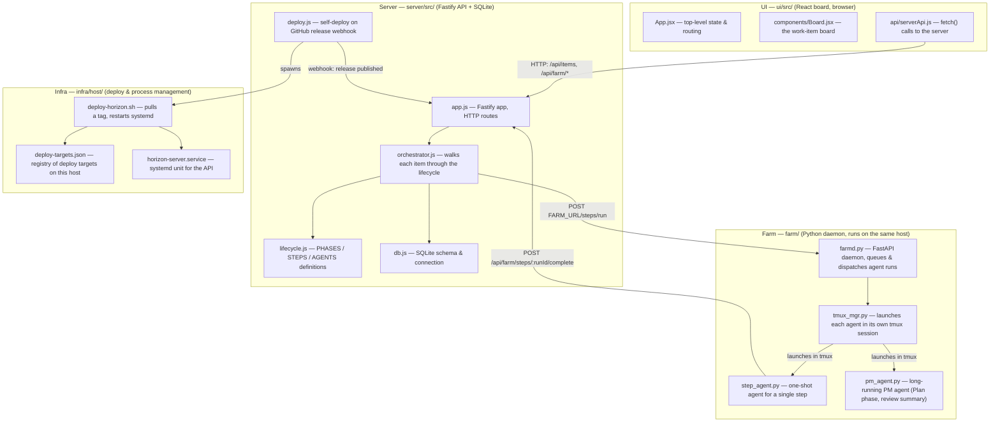
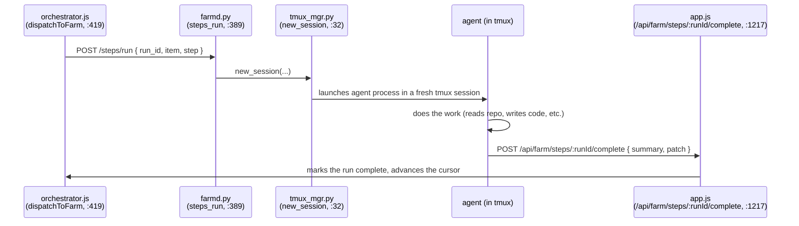

# Architecture — codebase layers

This is a map of Horizon for a reader who has never opened this repo before.
Horizon is a small system that runs software work items through a fixed
development lifecycle, dispatching each step either to a human (via the web
board) or to an AI agent (via a farm of tmux sessions). There are four real
layers, plus a deploy layer that ships changes to the one server that runs
all of this.

## The four layers, in plain terms

- **UI (`ui/`)** — a React app the browser loads. It shows the board of work
  items, lets a human approve/reject gates, and polls/streams the server for
  state. It never talks to the farm directly — only to the server's HTTP API.
  Key files: `ui/src/App.jsx` (top-level state), `ui/src/components/Board.jsx`
  (the board view), `ui/src/api/serverApi.js` (all `fetch()` calls to the
  server, e.g. `GET /api/items`).

- **Server (`server/src/`)** — a [Fastify](https://fastify.dev) (not Express)
  Node app. It is the single source of truth: it owns the SQLite database,
  exposes the HTTP API the UI and GitHub webhooks call, and runs the
  **orchestrator**, which is the part that actually moves work items forward.
  Key files: `server/src/app.js` (routes, e.g. `/api/items`,
  `/api/webhooks/github`, `/api/farm/*`), `server/src/orchestrator.js` (drives
  each item's `cursor` through the lifecycle — see `docs/workflow.md`),
  `server/src/lifecycle.js` (the lifecycle definition itself: which phases
  and steps exist), `server/src/db.js` (SQLite schema).

- **Farm (`farm/`)** — a Python [FastAPI](https://fastapi.tiangolo.com)
  daemon (`farmd.py`) that runs on the same host as the server. When the
  orchestrator needs an AI agent to do a step (e.g. "Draft implementation
  plan"), it calls the farm, which launches that agent inside its own
  [tmux](https://github.com/tmux/tmux/wiki) session (`tmux_mgr.py`) so its
  output can be tailed live and it survives independently of any one HTTP
  request. `step_agent.py` runs a single step and exits; `pm_agent.py` is a
  longer-lived agent used for the Plan phase and the review-summary step.

- **Infra (`infra/host/`)** — not application code, but the scripts and
  config that get a merged change onto the running server. A published
  GitHub Release triggers `server/src/deploy.js`, which spawns
  `infra/host/deploy-horizon.sh` (looked up via
  `infra/host/deploy-targets.json`), which pulls the new tag and restarts the
  `horizon-server` systemd service. There is one EC2 host, no load balancer,
  no separate database server — see `infra/host/DEPLOY.md` for the full
  runbook.

## How a request actually flows (one example)

A human clicking "Approve" in the UI, or an agent finishing a step, both end
up as an HTTP call into `server/src/app.js`, which calls into
`orchestrator.js` to advance that item's `cursor`. When the *next* step is an
agent step, the orchestrator calls the farm over HTTP:

`orchestrator.js`'s `farmFetch` (line 160) is the one function that talks to
the farm; every farm-bound HTTP call goes through it.

## Where things live, quick reference

| Layer | Directory | Runs as | Talks to |
| --- | --- | --- | --- |
| UI | `ui/src/` | static build, served by the browser | Server (HTTP) |
| Server | `server/src/` | Node process (`horizon-server` systemd unit) | UI, Farm, GitHub, SQLite |
| Farm | `farm/` | Python process, spawns tmux sessions | Server (HTTP, both directions) |
| Infra | `infra/host/` | shell scripts + systemd units | the host itself |

For the lifecycle those layers cooperate to run, see
[`docs/workflow.md`](workflow.md).
