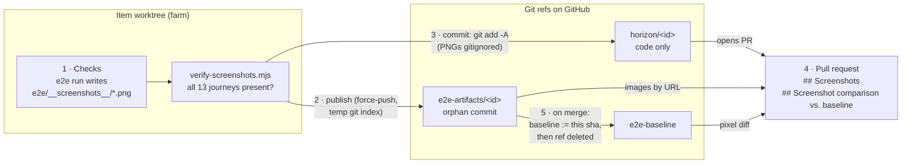
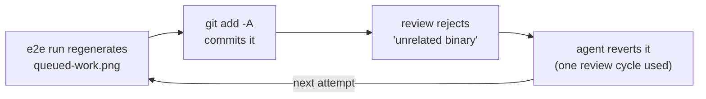

# E2E screenshots — from a test run to the PR and the baseline

Every implement run photographs the UI at 13 points in the e2e journeys, so a
reviewer at the "Accept the code" gate can see what the change looks like, and
what changed visually, without checking out the branch. This doc explains
where those PNGs go and why they **never ride on the code branch**.

## Why not just commit them?

A PNG has no merge strategy. When screenshots were committed with the code, any
two branches that regenerated the same journey's screenshot conflicted, even if
their code didn't (HZ-63). So `e2e/__screenshots__/` is gitignored, and the
pixels travel on their own git refs instead.

## The three refs

| Ref | Holds | Written by | Lifetime |
|---|---|---|---|
| `horizon/<id>` | The item's code. Never screenshots. | `finalize_branch()` in `farm/step_agent.py`, after checks pass | Deleted when the PR merges |
| `e2e-artifacts/<id>` | This item's PNGs, as a single commit with no history | `publish_screenshots()` in `farm/step_agent.py`, force-pushed on every implement run | Deleted when the PR merges or is closed unmerged |
| `e2e-baseline` | The screenshots of the last merged item | `promoteBaseline()` in `server/src/github.js`, called from `mergePr()` | Permanent; moves on every merge |

`<id>` is the lowercased item id, e.g. `e2e-artifacts/hz-143`.

## The pipeline

### 1 · Checks: capture and verify

- Each Playwright journey calls `captureScreenshot(page, name)`
  (`e2e/fixtures/test-base.js`), which writes `e2e/__screenshots__/<name>.png`.
  A failed capture only warns; it never fails the test.
- `e2e/package.json`'s `test` script ends with `node verify-screenshots.mjs`,
  which fails the run if any of the 13 names in `EXPECTED_JOURNEYS` is missing.
  Add a name there when you add a journey that captures a screenshot.
- Checks run **before** anything is committed or pushed ("no green, no push").
  A failed check discards the attempt, so nothing below happens.

### 2 · Publish: `publish_screenshots()`

Once checks pass, the farm builds a commit containing only the PNGs, without
touching the working tree or the real index:

1. Point `GIT_INDEX_FILE` at a temporary index.
2. `git hash-object -w` each PNG, then `git update-index --cacheinfo` it into
   the temp index at `e2e/__screenshots__/<name>.png`.
3. `git write-tree` → `git commit-tree` (no parent, so an orphan commit).
4. Force-push that commit to `refs/heads/e2e-artifacts/<id>`.

This is best-effort. A failure is logged and skipped, and the implement step
carries on. The log says `publish_screenshots: pushed N screenshot(s) to …`,
or `no screenshots to publish — skipped` for items whose runs produce none.

### 3 · Commit: `finalize_branch()`

`git add -A`, commit, `git push --force-with-lease` to `horizon/<id>`. Because
`e2e/__screenshots__/` is in `.gitignore`, the PNGs stay out of the commit,
**as long as none of them is already tracked** (see
[the pitfall below](#pitfall-a-tracked-screenshot-defeats-gitignore)).

### 4 · Review: the PR description

`createPrFromBranch()` reads the artifacts ref, never the code branch, and
adds two sections to the PR body:

- **`## Screenshots`**: one image per PNG, linked by the GitHub contents API's
  `download_url` for `e2e-artifacts/<id>`. The URL names the ref, not a sha,
  so a later implement run's force-push updates the images in place without
  editing the PR.
- **`## Screenshot comparison vs. baseline`**: a table comparing each PNG
  with the same name on `e2e-baseline`, using `pixelmatch` with a per-pixel
  `threshold` of 0.1. A screenshot counts as **changed** only if more than 1%
  of its pixels differ (`DIFF_RATIO_TOLERANCE = 0.01`), which absorbs
  anti-aliasing noise. With no baseline yet (the repo's first merge), the table
  is omitted. The table is computed once, when the PR is opened.

Both are "never throw": a 404 or GitHub hiccup just drops the section.

### 5 · Merge: `promoteBaseline()`

When the "Accept the code" gate merges the PR (squash), `mergePr()`:

1. Deletes `horizon/<id>`.
2. Moves `e2e-baseline` to the sha of `e2e-artifacts/<id>` (`PATCH` with
   `force: true`; creates the ref on the repo's first merge). This is a plain
   overwrite, not read-modify-write, so two merges landing close together are
   safe: last writer wins, and either value is a real merged UI.
3. Deletes `e2e-artifacts/<id>`.

All three steps are best-effort. If promotion fails, the baseline stays one
merge behind until the next merge. The baseline only ever moves on merge,
never from a PR branch.

If the PR is **closed unmerged** on GitHub, the item is sent back and
`e2e-artifacts/<id>` is deleted. The next implement attempt republishes it.

## Pitfall: a tracked screenshot defeats `.gitignore`

`.gitignore` only affects untracked files. If a PNG under
`e2e/__screenshots__/` was committed before the ignore rule existed (or
force-added), git keeps tracking it, and every e2e run's regenerated copy shows
up as a modification that `git add -A` commits.

That's what trapped HZ-143. Three stale PNGs (`abandon`, `artifact-history`,
`queued-work`) were still tracked on `main`, which caused this loop:

No agent can exit this loop, because the check step regenerates the file on
every attempt. PR #149 fixed it with `git rm --cached` on the three files.

**How to check:** `git ls-files e2e/__screenshots__` must print nothing. If it
prints anything, untrack those files the same way.

## Where to look

| What | File |
|---|---|
| Capture helper | `e2e/fixtures/test-base.js` (`captureScreenshot`) |
| Presence check | `e2e/verify-screenshots.mjs` (`EXPECTED_JOURNEYS`) |
| Ignore rule | `.gitignore` (`e2e/__screenshots__/`) |
| Publish + commit order | `farm/step_agent.py` (`publish_screenshots`, `finalize_branch`) |
| PR body, diff, promotion, cleanup | `server/src/github.js` (`screenshotsMarkdown`, `compareScreenshotsMarkdown`, `createPrFromBranch`, `promoteBaseline`, `mergePr`) |
