# Onboarding a new project, end to end (HZ-400)

This guide adds a project to Horizon, from an empty Admin row to a first item
on the board. Follow the steps in order. Each step says:

- **What to enter:** the values you type or choose.
- **Where:** the screen, panel and control.
- **Done when:** what the screen shows when the step worked.
- **If it fails:** what to check, and what to do.

The examples use a made-up project, `Example Co`, with one repo,
`example-org/example-app`. The first real use is the existing, disabled
**Shoreward** project (`FinTekkers/shoreward`): put its name and repo
wherever the examples say `Example Co` and `example-org/example-app`.

Some steps are not possible in the product yet. They say so, link to
[Known gaps](#known-gaps), and give a way round them.

**Writing conventions.** A UI label, button or route is in bold code, like
**`Create project`** or **`/admin`**. A test (`server/test/docs-project-onboarding.test.mjs`)
fails if one of them disappears from `ui/src`, so if you rename a button,
update this guide in the same PR. Plain code, like `npm test`, is something
you type or a file path.

The screenshots come from a demo server with fake data. Your screens show
your own projects and items.

## Before you start

Have these ready before step 1:

- **GitHub access to the repo.** Horizon uses one GitHub token for every
  connected repo. It lives in Admin's **`GitHub access`** panel. The token
  must cover the new repo with read and write on Issues, Actions, Contents and
  Pull requests, and read on Checks and Commit statuses. A fine-grained token
  also needs Webhooks set to Read and write, so Horizon can create the
  webhook in step 2. The panel's own "How to create a token" list leaves that
  out (see [Known gaps](#known-gaps)).
  If the panel says **`No token yet`**, or the token does not cover the new
  repo, make a new token and paste it with **`Save token`**. Never paste a
  token anywhere else: not in rules, not in check commands, not in an item.

  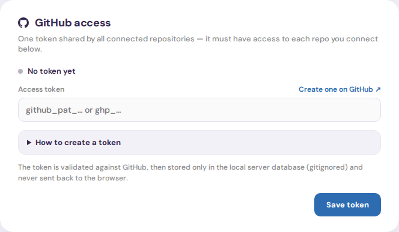

- **Your gate PIN.** Every change in this guide asks for it. It is separate
  from your login. If you don't have it, go to Admin's
  **`Security · your gate PIN`** panel and press **`Regenerate my PIN`**. The
  new PIN is shown once, so write it down somewhere safe. Regenerating it
  makes your old PIN stop working.

  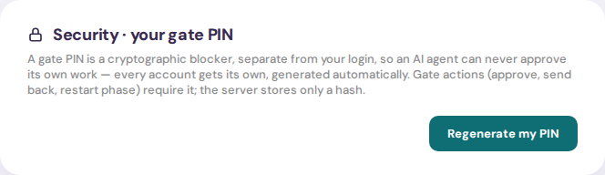

- **Where the deploy scripts and env files go on the host.** Skip this if the
  project never deploys from Horizon.
  - The deploy script goes in `infra/host/` in the Horizon repo. Copy the
    closest one, as `infra/host/DEPLOY.md` ("Adding a new target") explains.
  - The service it restarts needs a `systemctl restart` line in
    `infra/host/horizon-deploy.sudoers`, and that file must be re-applied on
    the host (`infra/host/DEPLOY.md` step 1).
  - Both of those land in a reviewed Horizon PR **before** step 5. Horizon
    refuses a deploy target whose script or service they don't cover.
  - The app's env file goes on the host under `/etc/`, next to the existing
    ones (for example `/etc/fintekkers/ledger.env` or
    `/etc/horizon/contact.env`). Its systemd unit names it with
    `EnvironmentFile=`. Secrets stay in that file and are referenced as
    `$NAME`, never written into the repo, a rule or this guide.
- **Admin access.** You open Admin from the avatar menu at the top right:
  **`Admin`** goes to **`/admin`**, and **`Agent definitions`** goes to
  **`/definitions`**.

## 1. Create the project

**What to enter:** the project's name, as the board should show it, for
example `Example Co`. For Shoreward the project already exists, so skip to
step 2.

**Where:** **`/admin`**, the **`Projects`** panel at the bottom of the page.
Type the name into **`New project name, e.g. Shoreward`** and press
**`Create project`**.

**Done when:** a new block with the project's name appears in the panel. Its
switch reads **`Disabled`**, and it says **`No repositories connected yet.`**
Only the very first project on a Horizon starts enabled. Any later one starts
disabled, so nothing runs until step 8.

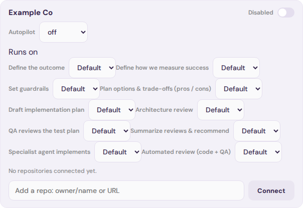

**If it fails:** an error under the input means the name is taken (names are
unique) or the server is down. Pick another name, or check that the server
is up. The button does nothing for a name shorter than 2 characters.

## 2. Connect its repos; the webhook is created and verified

**What to enter:** each repo as `owner/name` or its GitHub URL, for example
`example-org/example-app`. Connect one repo at a time.

**Where:** **`/admin`**, inside the project's block: **`Add a repo: owner/name or URL`**,
then **`Connect`**. Horizon checks the repo with the token, starts syncing
its issues and creates the repo's webhook (HZ-244).

**Done when:** the repo shows as a row in the block, with its item prefix,
for example `EX-*`. Its webhook badge reads `Webhook: ok`. After the first
event it also shows a last delivery code, like `last delivery 200`. Issues
that are open in the repo turn into items on the board, under this project.
They wait there until the project is enabled in step 8.

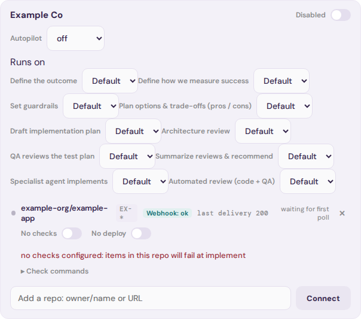

**If it fails:**

- An error under **`Connect`** means the token can't see the repo. Fix the
  token in **`GitHub access`** (see [Before you start](#before-you-start)),
  then connect again.
- The badge reads `Webhook: missing` or `Webhook: mismatched`. A note under
  the row says what this breaks. Press **`Fix webhook`**, enter your PIN in
  **`Gate PIN to fix this webhook`**, and press Fix.

  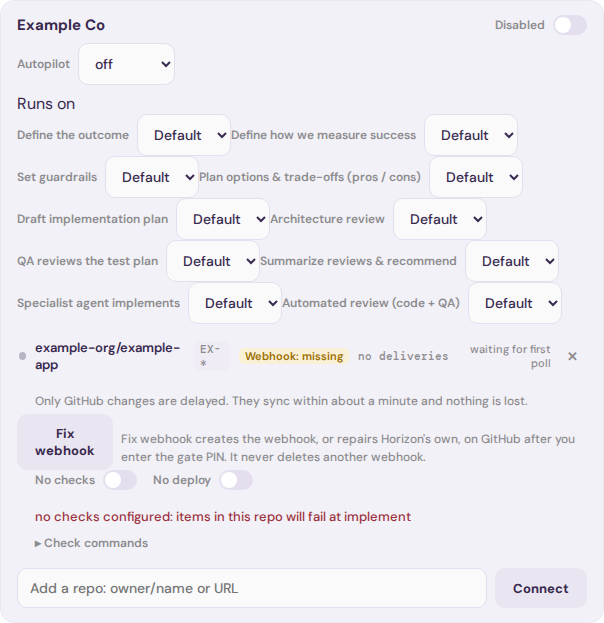

- The badge reads `Webhook: error (secret not configured)` or
  `(webhook URL not public)`. The server's own settings are missing:
  `$GITHUB_WEBHOOK_SECRET`, or a public `HORIZON_UI_URL` (the webhook URL is
  built from it), in `/etc/horizon/server.env`. Fix them on the host, restart
  `horizon-server`, then press **`Fix webhook`**.
- The badge reads `(other host)`. The repo already has a webhook pointing at
  another server. Remove that hook in the repo's GitHub settings, then press
  **`Fix webhook`**.

## 3. Set the check commands

**What to enter:** the commands that prove a change works in this repo, one
per line. For example **`Install`** `npm ci`, **`Test`** `npm test`,
**`Lint`** `npm run lint`. Leave a box empty to skip it. Never put tokens or
secrets in a command (HZ-245).

**Where:** **`/admin`**, under the repo's row: open **`Check commands`**.
Fill the boxes, enter your PIN in **`Gate PIN to save`** and press
**`Save commands`**. The grey hints in empty boxes are only suggestions. A
hint never runs until you type it in.

**Done when:** **`Check commands saved.`** appears. The red warning
**`no checks configured: items in this repo will fail at implement`** under
the row has gone.

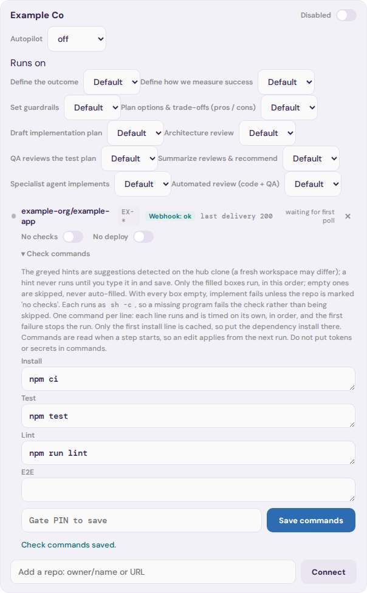

**If it fails:**

- **`Gate PIN incorrect`**: enter the PIN again, or regenerate it (see
  [Before you start](#before-you-start)).
- A repo with nothing to check, like a docs-only repo, can be marked
  **`No checks`** with the switch on the same row. Without commands or that
  mark, every item in the repo fails at implement.
- A command that works on your laptop can still fail on the farm. Commands
  run with `sh -c` in a fresh workspace. Make the first install line install
  every dependency the rest need.

## 4. Set the project and repo rules

**What to enter:** short rules that every agent working on this project must
follow (HZ-246). Project rules cover the whole project, for example service
start order or shared environment quirks. Repo rules cover one repo, for
example how to build, run and test it. Use `$ENV_VAR` names, never secret
values.

**Where:** **`/definitions`**. In the left list, find the project under
**`Projects`** and the repo under **`Repositories`**. Each is listed by its
key: the project name in lower case with dashes (`example-co`), and the repo
with `__` for `/` (`example-org__example-app`). Pick one, type the rules into
the editor, enter your PIN in **`Gate PIN`** and press **`Save new version`**.
Do the same for each repo.

**Done when:** **`Saved as version`** `1` appears, and the note under the
editor reads **`Agents get saved version`** `1.` Press
**`Preview effective prompt`** to see the rules as an agent receives them.

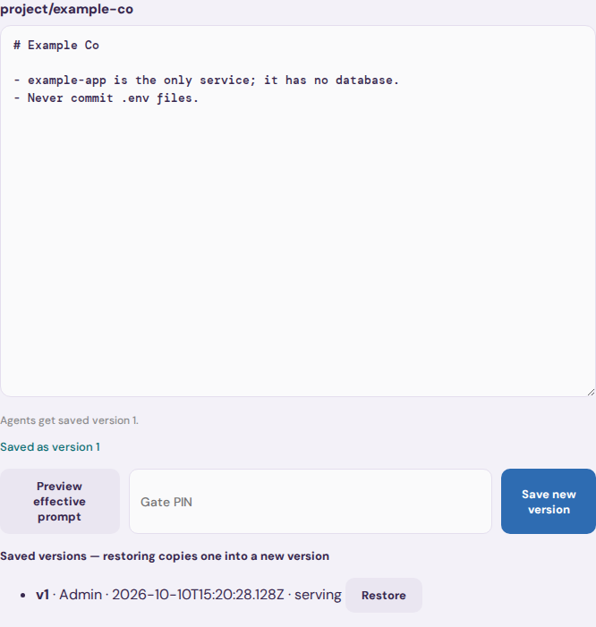

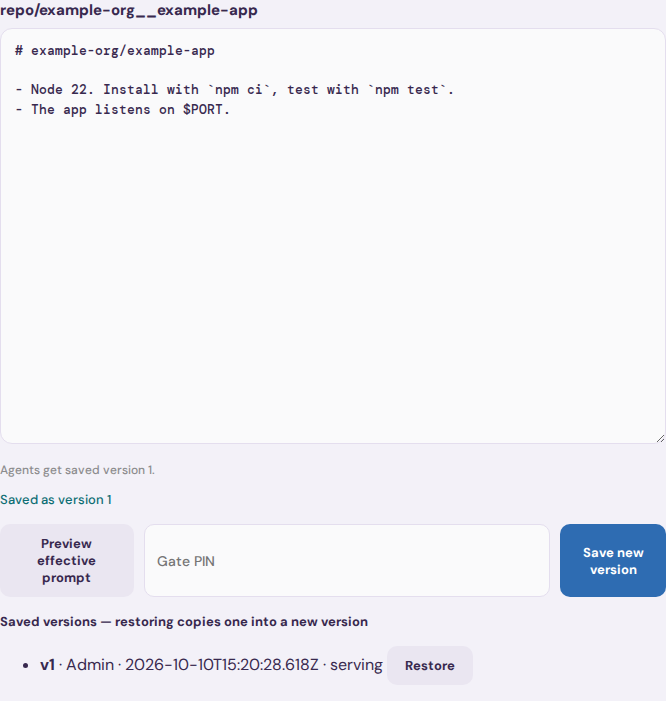

**If it fails:**

- The project or repo is not in the list: reload the page after steps 1 and 2.
- **`Gate PIN incorrect`**: enter it again.
- A save that answers 503 means the server has no rules signing secret. Set
  `RULES_HMAC_SECRET` in `/etc/horizon/server.env`, as
  `infra/host/DEPLOY.md` section 2g says, and restart `horizon-server`.
- A save refused for its content usually means it looks like a secret.
  Replace the value with a `$NAME` reference.

## 5. Set up deploy targets and do a Dry run

Skip this step if the project never deploys from Horizon.

**What to enter:** one deploy target per deployable repo (HZ-263): a
**`Key`**, the **`Script`** in `infra/host/`, the systemd **`Service`** it
restarts, the **`Repo dir`** checkout on the host, a **`State key`**, the
**`Health URL`** and the **`Health check type`**. The script and the
service must already be merged into Horizon (see
[Before you start](#before-you-start)).

**Where:** **`/admin`**, the **`Deploy target overrides`** panel. Find the
repo's row and press **`Add target`**. Fill the form, press Save, enter your
PIN in **`Gate PIN to save`** and press **`Confirm save`**. Then go to the
**`Deploy targets`** panel above it, open **`Dry run`** on the new target
(HZ-258), enter your PIN in **`Gate PIN to dry-run`** and press **`Run`**.
A Dry run only reads. It never deploys, restarts or writes anything.

**This panel lists only repos of enabled projects.** A disabled project's
repo has no row, so you can't add its target yet. See
[Known gaps](#known-gaps). Until that is fixed, do this step straight after
step 8, before you file the first item in step 9.

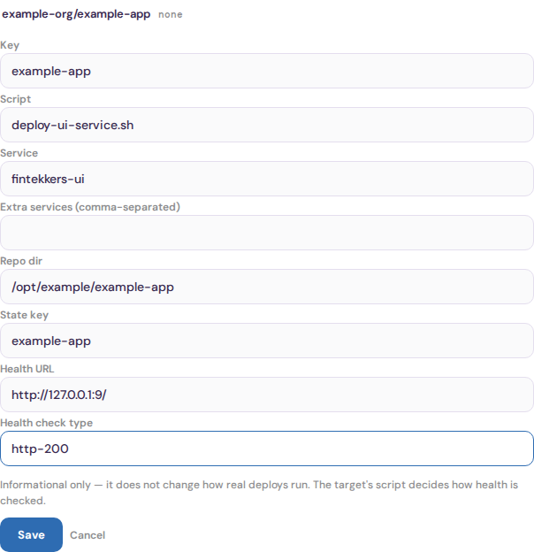

**Done when:** the row shows the target's key, script and service instead of
`none`. Then the Dry run lists five checks, `script`, `repo dir`, `service`,
`sudo` and `health`, and **every one says pass**. The screenshot comes from
the demo server, which has no checkout and no running app, so two of its
checks fail. That is what a failure looks like.

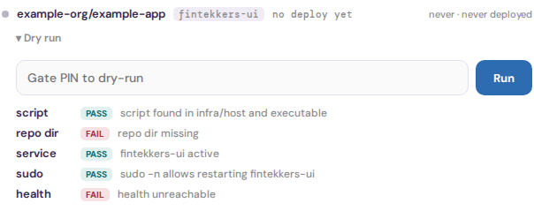

**If it fails:**

- The save says the service is not in `horizon-deploy.sudoers`, or the
  script is outside `infra/host/`. Land that Horizon PR first.
- `repo dir missing`: clone the repo to that path on the host.
- `service` fails: install and start the systemd unit, with its env file.
- `sudo` fails: re-apply the sudoers file on the host
  (`infra/host/DEPLOY.md` step 1).
- `health` fails: the app is not answering on the **`Health URL`**. Check
  the service log with `journalctl -u <service>`.
- **`Gate PIN incorrect`**: enter it again.

## 6. Choose the provider/model defaults

**What to enter:** for each agent step, which provider runs it by default
for this project: **`Default`**, **`Claude`** or **`Muse`**. Leave
**`Default`** unless you have a reason to change it. An item can still pick
its own provider. The model is not a per-project choice yet.

**Where:** **`/admin`**, inside the project's block, under **`Runs on`**. Pick
a provider in a step's list, enter your PIN and press Save. To see which
model each step uses, open **`/definitions`** and expand
**`Models — which Claude model each agent call uses`**. That table is read
only. See [Known gaps](#known-gaps).

**Done when:** each list under **`Runs on`** shows the provider you chose,
and still shows it after a reload. The models table lists the model for every
step.

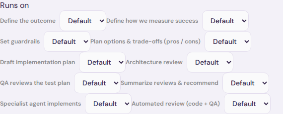

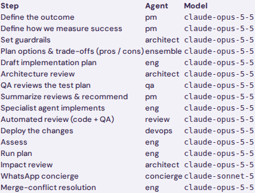

**If it fails:** **`Gate PIN incorrect`** leaves the list as it was. Enter
the PIN again. To change a model, someone has to edit
`domain/personas.json` in a reviewed Horizon PR. That change applies to
every project.

## 7. Run the Validate project pre-flight

**There is no Validate project button in Admin yet** (HZ-248). The server can
run the checks, but the UI has no way to start them. See
[Known gaps](#known-gaps). Until it ships, do the same six checks by hand.
They are the ones done by hand for FinTekkers on 2026-10-02.

**What to enter:** nothing new. This step only checks steps 1 to 6.

**Where:** **`/admin`**, the project's block and the deploy panels:

1. **Repo access.** The repo's row shows no sync error, and its status says
   `checked <time>`.
2. **Webhook.** The badge reads `Webhook: ok` (step 2).
3. **Check commands.** No red **`no checks configured: items in this repo will fail at implement`**
   warning (step 3). Run the same commands yourself on a fresh clone of
   `main` and make sure they pass.
4. **Rules.** In **`/definitions`**, each project and repo note reads
   **`Agents get saved version`** (step 4).
5. **Dry run.** All five checks pass (step 5). Do this after step 8, as
   step 5 says.
6. **Drift.** The deployed tag in **`Deploy targets`** matches what you
   expect `main` to have. A new target says `no deploy yet`.

**Done when:** all six checks hold. The project block looks like this, with
the webhook ok and no red warning:

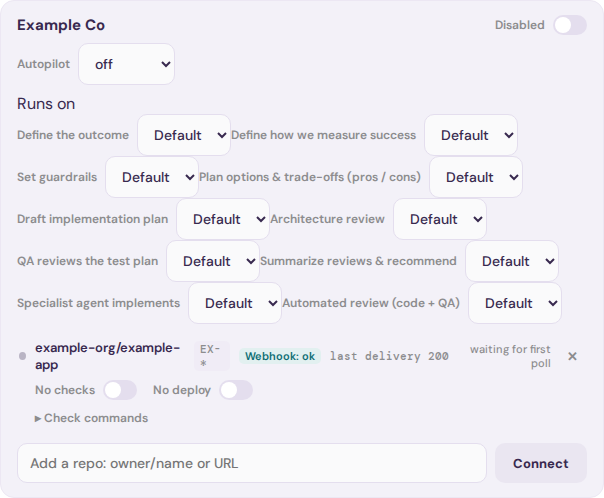

**If it fails:** go back to the step for the check that failed. Don't enable
the project (step 8) until every check holds, except the Dry run, which waits
for step 8.

## 8. Enable the project, and decide on Autopilot

**What to enter:** turn the project on. Leave Autopilot on **`off`** for a new
project. Agents then do the work, and a person approves every gate.

- **`shadow`** has an agent judge each gate and record what it *would* do,
  but it never acts. Use it once you trust the project's rules.
- **`on`** lets the agent approve or send back some gates by itself. Only
  use it after a run of good shadow decisions.

**Where:** **`/admin`**, the project's block. Click the
**`Disabled`** switch, enter your PIN and press Enable. Change
**`Autopilot`** with the list under the project's name. That also asks for
your PIN.

**Done when:** the switch reads **`Enabled`**, and **`Autopilot`** shows the
mode you chose. Items from the repo's open issues start moving on the board.

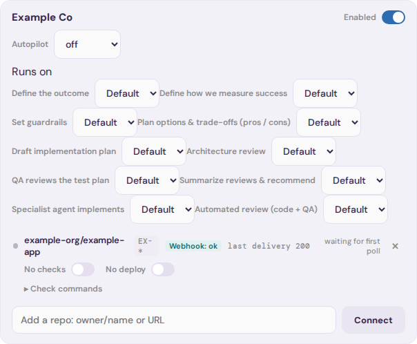

**If it fails:** **`Gate PIN incorrect`** leaves the switch as it was.
Enter the PIN again. To stop everything at once, turn the switch back to
**`Disabled`**. Nothing new is dispatched for the project after that.

Now go back to step 5 if you skipped it, then finish step 7's Dry run.

## 9. File and watch a first small item

**What to enter:** a small, low-risk change, so the first run tests the
setup rather than the code. Give it a one-line title, an outcome and a
success metric, for example "Add a health endpoint".

**Where:** the board at `/`. Press **`+ New work item`**, pick the project,
fill in the form and press **`Create work item`**. Horizon files it as a
GitHub issue in the repo, and the issue becomes an item on the board. Use
**`Project filter`** at the top to show only this project.

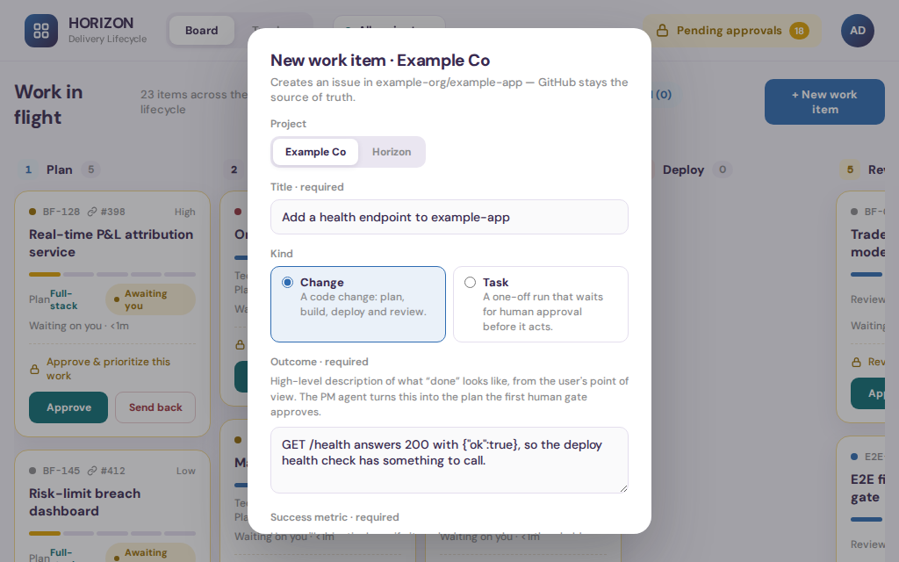

**Done when:** the item appears in the first column with the repo's prefix,
for example `EX-1`. It moves through the steps, and stops at each gate for
your approval under **`Pending approvals`**. The first run is done when its
pull request is merged and, if the repo deploys, the deploy is green.

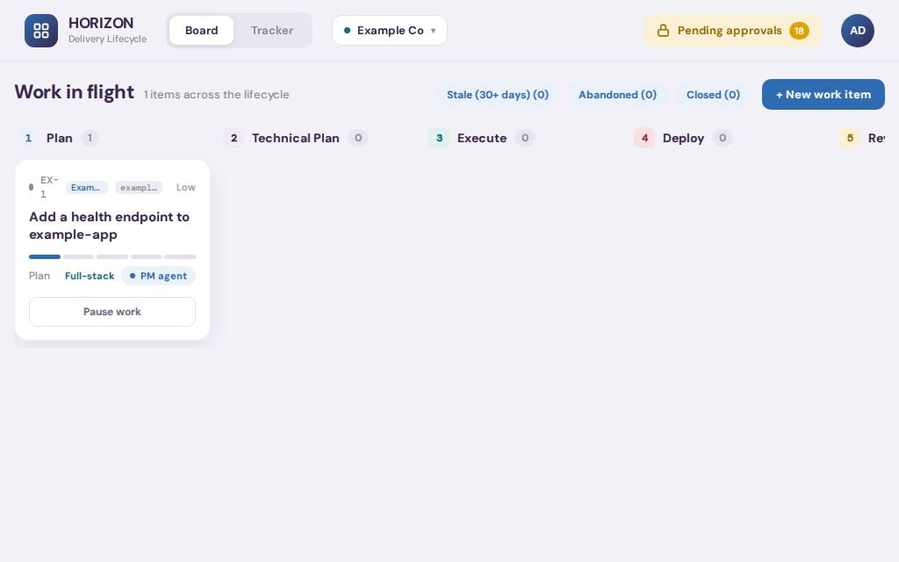

**If it fails:**

- The item stops with a check failure at implement: fix the commands from
  step 3. The item's page shows which command failed.
- The deploy fails: run the Dry run again (step 5) and read the deploy log,
  `~/.horizon/<stateKey>/self-deploy.log` on the host.
- Nothing moves: make sure the project is **`Enabled`** (step 8).
- To stop the run, press **`Pause work`** on the card.

## Known gaps

These are missing from the product today. Each one is listed with the label
it would have, and a test checks that the label is still absent from
`ui/src`. When one ships, that test fails: update the step above and remove
the entry.

- **`Validate project`** (HZ-248). The server runs the six pre-flight checks
  (`POST /api/projects/:id/validate`), but Admin has no button to start them
  or show the result. Step 7 does them by hand.
- **`Include disabled projects`** (HZ-263 follow-up). **`Deploy target overrides`**
  lists only repos of enabled projects, so a disabled project's deploy target
  can't be added before the project is enabled. Step 5 is done after step 8.
- **`Webhooks — Read and write`**. The **`GitHub access`** panel's "How to
  create a token" steps don't list the Webhooks permission, which a
  fine-grained token needs before Horizon can create or fix a webhook.
  [Before you start](#before-you-start) lists it.
- **`Default model`**. Only the provider can be set per project and step.
  The model each step uses is read only in **`/definitions`**, and changes
  only by a Horizon PR to `domain/personas.json`, for every project.

## Regenerating the screenshots

The images in `docs/images/onboarding/` are committed. They are not part of
the e2e run and never change unless someone runs this on purpose:

```
npm --prefix e2e run screenshots:onboarding
```

It runs `e2e/onboarding/onboarding-shots.spec.js` with
`e2e/onboarding.config.js` against the demo server: a temp database, mock
agents, no GitHub token and no farm. It never touches the live Horizon,
Shoreward or GitHub. Each test checks the step's "Done when" state before it
takes the picture, and fails if a page shows anything shaped like a GitHub
token.

**Run it alone**, not while `npm --prefix e2e test` runs in the same
worktree. Both use the same ports and the same login (storage-state) file,
so they would break each other. Do a first-time setup with
`npm run test:e2e` at the repo root. It installs the browser.
