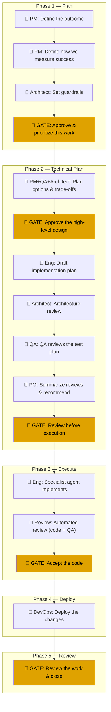

# Workflow — how a task moves from definition to done

Every unit of work in Horizon is a **work item** (usually backed by a GitHub
issue). Every work item follows the exact same fixed sequence of steps —
there is no per-item customization today. That sequence is defined once, in
code, at `server/src/lifecycle.js`, as five **phases** containing sixteen
**steps**. This doc explains that sequence for a reader who has never seen
the codebase.

## The two kinds of step

- 🤖 **Agent step** — the server hands the step to an AI agent (via the farm,
  see [`docs/architecture.md`](architecture.md)) and waits for it to report
  back. No human action is required to *start* it.
- 🚦 **Gate step** — work stops here until a human clicks Approve (or
  Reject) in the UI. Every gate in the current lifecycle is `required`.

## The full sequence

Yellow boxes are gates (human required); the rest run automatically once
their turn comes up. This mirrors `PHASES` and `STEPS` in
`server/src/lifecycle.js:15-34` exactly — that file is the source of truth,
and this diagram will drift if it changes without this doc being updated.

## Which agent does what

Every agent step names an agent from `AGENTS` in `server/src/lifecycle.js:5`:

| Agent | Role |
| --- | --- |
| **PM** | Defines outcome/success criteria, synthesizes review summaries |
| **Architect** | Sets guardrails, reviews architecture of a plan |
| **Ensemble** | PM + QA + Architect together, for the options/trade-offs step |
| **Eng** | Drafts the implementation plan, then implements the code |
| **QA** | Reviews whether the test plan is sufficient |
| **Review** | Automated code + QA review after implementation |
| **DevOps** | Deploys the change |

## What "current step" and "done" mean

Each work item stores a single number, `cursor` — its index into the 16-step
`STEPS` array. `curStep(item)` (`server/src/lifecycle.js:53`) looks up
`STEPS[item.cursor]` to find what's next; an item is closed
(`isClosed`, `lifecycle.js:43`) once `cursor >= STEPS.length`, i.e. it has
passed the final "Review the work & close" gate. There is no other "done"
state — paused and blocked (below) are both independent of, and do not
change, the cursor.

## A concrete walk-through

1. A human (or a synced GitHub issue) creates a work item. Its `cursor`
   starts at `0` — step 1, "Define the outcome," a PM agent step.
2. The orchestrator (`server/src/orchestrator.js`) sees the item is
   `runnable()` and dispatches step 0 to the farm. The PM agent runs, writes
   its output back via `POST /api/farm/steps/:runId/complete`, and the
   orchestrator advances `cursor` to `1`.
3. Steps 1 and 2 repeat the same agent-dispatch pattern.
4. `cursor` reaches step 3, a gate. The orchestrator stops — no agent is
   dispatched. The item sits here until a human opens the UI and approves.
5. On approval, `cursor` advances to `4` and Phase 2 begins the same way:
   agent steps run automatically, gate steps wait for a human.
6. This repeats through Phase 3 (Execute — the actual code gets written and
   reviewed), Phase 4 (Deploy — a real GitHub Release gets published and the
   host redeploys, see [`docs/architecture.md`](architecture.md)), and
   Phase 5 (a final human review and close).
7. Once `cursor` passes index 15 (the last step), `isClosed(item)` is `true`
   and the item is done.

## Two things that can interrupt "ever-forward"

- **Paused.** A human can pause an item at any point (a UI action, tracked
  separately from `cursor`). A paused item's steps simply don't get
  dispatched until resumed.
- **Blocked (dependencies, see `README.md`'s Dependencies section).** A work
  item can declare it depends on another. `isBlocked` (`lifecycle.js:64`)
  checks whether *any* declared blocker has not yet closed; if so, the
  orchestrator's `runnable()` refuses to dispatch this item's steps at all,
  regardless of `cursor`. A blocker that is abandoned (soft-deleted, not
  closed) still blocks — `isBlockedByAbandoned` flags this case distinctly
  so it doesn't silently look like ordinary in-progress work.

Both are independent of the phase/step sequence itself — they gate *whether*
the next step runs, not *which* step is next.

See [`docs/architecture.md`](architecture.md) for how each step's agent
dispatch physically works (server → farm → tmux → agent → server).
